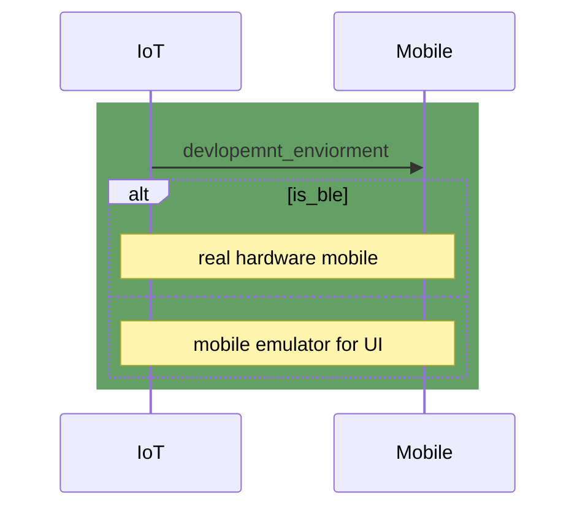

# gateway-devices
Git submodules contain supported device, board-schematic, mock emulator codebase

#### Hardware Part
```Part could be order (cheaply) - here are direct link for visual aspect```


```BLE Board```
1. [ESP32 TTGO T8 V1.7](https://vi.aliexpress.com/item/33043952133.html)
``` Sensor part```
1. [Radar motion Sensor : RCWL-0516](https://www.amazon.com/RCWL-0516-Microwave-Induction-Envistia-Mall/dp/B07QMZF1BV)
1. [RFID/NFC : PN532](https://electropeak.com/pn532-nfc-rfid-reader-writer).
1. [Contact-less Infrared Sensor : MLX90614](https://www.adafruit.com/product/1748)
1. [Cheap proximity sensor : UNKNOWN](https://www.engineersgarage.com/proximity-sensors-optical-ultrasonic-inductive-magnetic-capacitive/) support MLX90614 reading in close range

```3D printed```


#### Wired diagram


#### 2. IoT division

Flutter application as an testing suite for IoT BLE is hard-complex to develop "within our develop resource and time"

I suggest using [LightBlue® — Bluetooth Low Energy] [IOS](https://apps.apple.com/us/app/lightblue/id557428110) | [Android](https://play.google.com/store/apps/details?id=com.punchthrough.lightblueexplorer&hl=vi&gl=US) [Window,Mac] also avablie if your machine has BLE

We're using a custom BLE GATT profile which means the UUID will be hard to look at but you guys can base on our documentation [here](https://github.com/GDSC-HSU/gateway-devices/blob/master/ble_uuid_conf.yml) where we define our BLE GATT services, characteristics.

```yml
gatt_profile:
  - BLE_SERVICE_THERMOMETER_UUID: "00000B00-5226-4AE0-8977-656FD3C42DA2"
```

When you get familiar with LightBlue, you will be able to know that every time the BLE board notify LightBlue will get it. But the format is kind of a mess so you have to **decode **it I suggest using a tool on the website http://www.unit-conversion.info/texttools/ascii/ to decode and see the value has been transfer over BLE protocol

```yml
BLE GATT:
 BLE_SERVICE_THERMOMETER_UUID: "00000B00-5226-4AE0-8977-656FD3C42DA2"
data:
 051 051 (ascii) => String: => 33 (ascii decode to text)
meaning: Data from THERMOMETER is 33 
```
---

##### Dont have board sensor "problem solved"
> What I would do when i don't have sensor to connect to BLE Board

You will use **BLE_SENSOR_EMULATOR** in short it allows your machine (PC) talk to BLE Board (ESP32) over serial and send data over BLE GATT.
**BLE_SENSOR_EMULATOR** are [located here](https://github.com/GDSC-HSU/gateway-devices/blob/master/serial_taklker.py) is a Python script with serial comunication

**```step to use```** 

1. Config your **```machine PORT```** in the Python script [here](https://github.com/GDSC-HSU/gateway-devices/blob/f8e9ac8967a8b4b7791e6821dc9990c71e83f9cd/serial_taklker.py#L12)
1. hit enter :>
1. base on while loop it will call BLE Board to send each package, you could re-configure to your liking

=> if you still on LightBLue you will see the data been notify


